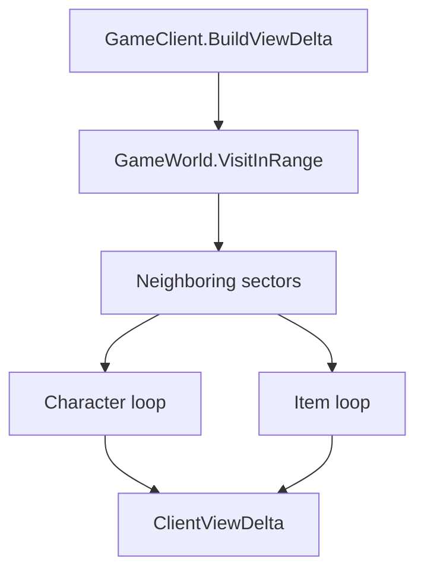

# Data Locality Audit

This audit turns the CPU cache/data-locality concern into measurable work before
any ECS or struct-array rewrite. The current architecture already uses sector
partitioning, active-sector ticking, dirty-object gating, NPC timer-wheel
scheduling, and separate multicore compute/apply phases. The next step is to
measure where pointer-heavy object access still dominates.

## Hot Paths

### Tick and Sector Work

- `src/SphereNet.Game/World/GameWorld.cs`
  - `OnTick`, `OnTickParallel`, `RefreshActiveSectors`, `TickSleepingSectorItems`.
  - Active ticking is limited to a 5x5 sector window around online players.
  - Sleeping-sector item maintenance still scans sector grids every 3 minutes.
- `src/SphereNet.Game/World/Sectors/Sector.cs`
  - `_characters`, `_items`, `OnTick`, `GetObjectsInRange`.
  - Lists are spatially grouped by sector, but entries are heap object references.
  - `AddCharacter`, `AddItem`, and online-player add paths use `List.Contains`.
- `src/SphereNet.Server/Program.Tick.cs`
  - `RunSingleThreadTick`, `RunMulticoreTick`, NPC decision build/apply, dirty drain,
    view delta build/apply.
  - Existing telemetry already splits snapshot, compute, NPC build, client state,
    NPC apply, view build, apply, and flush timings.

### View and Range Queries

- `src/SphereNet.Game/Clients/GameClient.ViewUpdate.cs`
  - `BuildViewDelta` calls `GetCharsInRange` and `GetItemsInRange`, which can sweep
    the same neighboring sectors twice.
  - The per-tile 80 item cap prevents client crashes, but item-dense views still
    hash per-item tile keys.
- `src/SphereNet.Game/World/GameWorld.cs`
  - `GetObjectsInRange`, `GetCharsInRange`, `GetItemsInRange`.
  - `yield return` chains add iterator overhead in the view hot path.
- `src/SphereNet.Game/AI/NpcAI.cs`
  - `BuildDecision`, `ApplyDecision`, path cache, active-area checks.
  - NPC work is timer-wheel gated, but active combat sectors still touch many
    scattered `Character` objects.

## Benchmark Scenarios

Run each scenario on the same hardware, same `sphere.ini`, same scripts, with a
warmup period before collecting numbers.

| Scenario | Purpose | Setup |
| --- | --- | --- |
| Idle baseline | Measure loop overhead | 1 online player, no stress NPCs, no stress items |
| Item density | Stress view/range queries | 1 online player, 10k ground items in and around view range |
| NPC active sector | Stress NPC AI and sector tick | 10-100 players, 10k NPCs concentrated in overlapping active sectors |
| Distributed players | Stress active-sector rebuild and view fan-out | 500-1000 simulated players spread across maps |
| Item stack crash guard | Stress per-tile cap path | 1 player, 100+ items on one `Point3D`, plus normal nearby clutter |
| Maintenance sweep | Stress sleeping sector item maintenance | Large map with many item sectors but few online players |

## Metrics to Capture

Use existing server logs first. Add instrumentation only where these are not
enough.

| Metric | Source | Why it matters |
| --- | --- | --- |
| Tick p50/p95/p99/max | `[tick_stats]`, `[slow_tick]` | User-visible lag and tail latency |
| Snapshot/compute/apply/flush us | `Program.Tick` telemetry | Identifies tick phase bottleneck |
| NPC build/apply us | `Program.Tick` telemetry | Separates AI decision cost from mutation cost |
| View build us | `Program.Tick` telemetry | Primary view/range data-locality signal |
| Dirty object count per drain | Existing dirty-drain sites, add counter if needed | Shows dirty coalescing and refresh fan-out |
| Refresh client count | `RunMulticoreTick` refresh client list | Normalizes view build cost per client |
| Range query calls and scanned objects | Add counters around `GetObjectsInRange` or typed alternatives | Measures sector sweep waste |
| Sector tick chars/items | Add optional counters in `Sector.OnTick` | Measures active-sector density |
| Per-map chars/items/active sectors/online players | `GameWorld.GetMapStats`, `/status.runtime.maps`, panel stats payload | Shows whether load is clustered enough to justify map workers |
| GC Gen0/Gen1/Gen2 and allocated bytes | `GC.CollectionCount`, `GC.GetTotalAllocatedBytes` | Detects iterator/list/delta churn |
| Working set and managed heap | `StressTestEngine.LogReport` | Memory pressure and LOH footprint |

## Baseline Capture Procedure

1. Start a staging shard with representative scripts and map data.
2. Record commit hash, build configuration, CPU model, core count, RAM, and
   `TickSleepMode`.
3. Warm up for 60 seconds.
4. Run one benchmark scenario for at least 3 minutes.
5. Capture:
   - all `[tick_stats]` lines,
   - all `[slow_tick]` lines,
   - `StressTestEngine.LogReport()` before and after,
   - GC collection counts before and after.
6. Repeat each scenario 3 times.
7. Compare median and p95, not a single best run.

## Current Baseline From Code Inspection

This is not a numeric benchmark. It is the current expected bottleneck map based
on the code paths above.

| Area | Expected pressure | Existing mitigation |
| --- | --- | --- |
| World tick | Active sector list iteration and scattered character/item objects | 5x5 active-sector gate, multicore sector tick |
| NPC AI | Active NPC `Character` object reads and path checks | Timer wheel, active-area gate, path cache |
| Dirty refresh | Dirty object drain allocation and nearby client marking | `ConcurrentDictionary` coalescing, sector online-player lists |
| View build | Double sector scan, iterator chains, per-client known set churn | `ViewNeedsRefresh`, known object caches, parallel build |
| Sleeping maintenance | Full sector-grid scan every interval | Skips active and empty item sectors |
| Recording/diagnostics | Potential full-world scans | Only active when feature is enabled |

## Optimization Options

| Option | Expected benefit | Risk | First metric to prove |
| --- | --- | --- | --- |
| Single-pass typed view range query | Cuts duplicate sector scans in `BuildViewDelta` | Low | View build us per refresh client |
| Callback/struct enumerator range APIs | Reduces iterator allocation and dispatch | Low-medium | Allocated bytes and Gen0 count |
| Reusable dirty-drain buffers | Removes repeated `Keys.ToArray`/list allocation | Low | Allocated bytes during dirty bursts |
| Sleeping item-sector index | Avoids full grid scan on maintenance | Low-medium | Maintenance slow_tick frequency |
| Packed tile key for item cap | Reduces `Point3D` dictionary hashing | Low | View build us in item-stack scenario |
| Sector membership side index/ref | Removes `List.Contains` on add | Medium | Move/spawn-heavy tick time |
| Hot-field sector snapshots | Improves view/NPC locality with structs | Medium-high | View/NPC build us, cache-miss profiler |
| Full ECS/SoA rewrite | Maximum locality potential | High | Only after lower-risk options fail |

## Recommended First Step

Start with a single-pass typed view range query plus allocation counters. It is
low risk because it keeps `Character` and `Item` as the source of truth and only
changes how `BuildViewDelta` visits nearby sector lists.

Do not introduce a map worker pool until `runtime.maps` shows sustained
per-map imbalance and the tick phase telemetry points to map-local work rather
than shared apply/flush costs.

Target shape:

Acceptance criteria for implementing that first optimization:

- Behavior tests for view visibility still pass.
- Item stack cap still limits each `Point3D` to 80.
- View build p95 improves or allocated bytes per refresh drops in at least two
  benchmark scenarios.
- No regression above 10 percent in idle baseline.

## Decision Rule

Do not start a broad ECS/SoA rewrite until:

- single-pass typed range query,
- dirty-drain allocation reuse,
- sleeping item-sector index,
- and packed tile cap key

have been measured and either implemented or rejected with numbers. If p95 tick
or view build still fails the target after these, then design a separate hot-field
snapshot layer before considering a full object-model rewrite.
